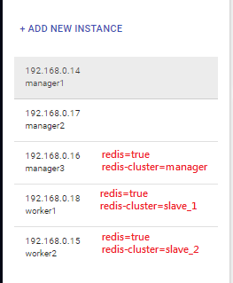
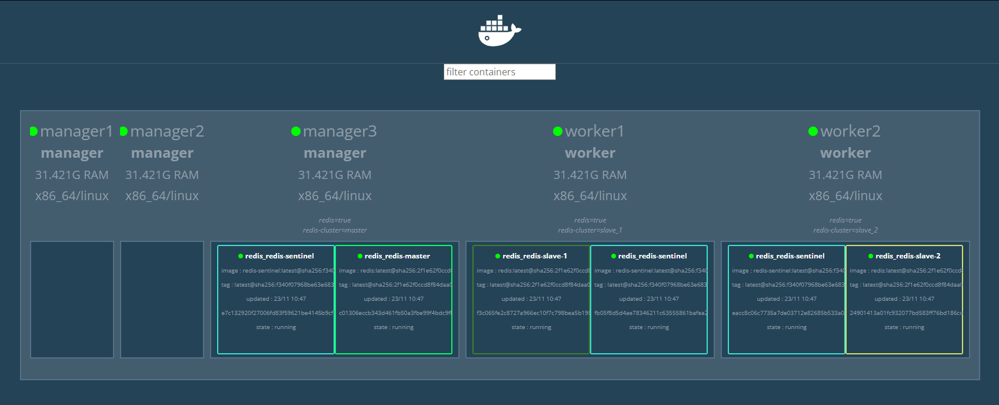
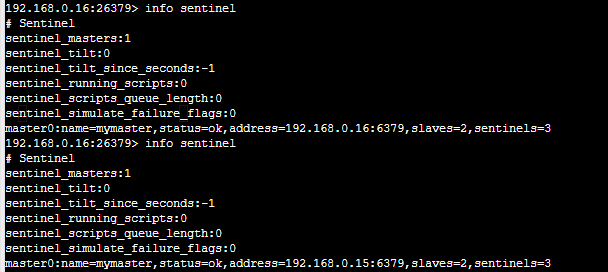
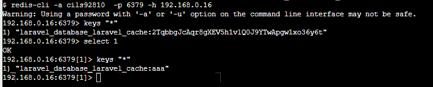
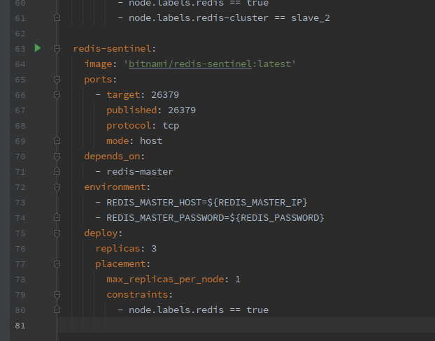

# laravel_redis_sentinel_test

## 環境
* docker-playground (https://labs.play-with-docker.com/)
* Templates: 3 Managers and 2 Workers



## 設定 Docker node label
```shell
docker node update --label-add redis=true manager3
docker node update --label-add redis=true worker1
docker node update --label-add redis=true worker2
docker node update --label-add redis-cluster=master manager3
docker node update --label-add redis-cluster=slave_1 worker1
docker node update --label-add redis-cluster=slave_2 worker2
```

## 設定 redis ip
```shell
cd redis
cp .env.example .env
vim .env
```

## 啟動 redis
```shell
env $(cat .env | grep ^[A-Z] | xargs) docker stack deploy -c docker-stack-redis.yml redis
```

## 非必要 visualizer
```shell
$ docker run -it -d -p 8080:8080 -v /var/run/docker.sock:/var/run/docker.sock dockersamples/visualizer
```


## 建立 laravel
```shell
cd ../laravel
docker-compose up -d
```

```shell
docker exec -it php-laravel-8 composer require predis/predis
```

修改 laravel 專案的 .env
```shell
vim ./my-project/.env
```
```dotenv
### modify
CACHE_DRIVER=redis
SESSION_DRIVER=redis

### modify
REDIS_PASSWORD={redis的密碼}
### add
REDIS_CLIENT=predis

### add
REDIS_SENTINEL_1=tcp://192.168.0.16:26379
REDIS_SENTINEL_2=tcp://192.168.0.18:26379
REDIS_SENTINEL_3=tcp://192.168.0.15:26379
```

修改 laravel 專案的 config/database.php 中 redis 的部分
```text
[---- 上略 ----]

    /*
    |--------------------------------------------------------------------------
    | Redis Databases
    |--------------------------------------------------------------------------
    |
    | Redis is an open source, fast, and advanced key-value store that also
    | provides a richer body of commands than a typical key-value system
    | such as APC or Memcached. Laravel makes it easy to dig right in.
    |
    */

    'redis' => [

        'client' => env('REDIS_CLIENT', 'phpredis'),

        'default' => [
            env('REDIS_SENTINEL_1') . '?timeout=0.1',
            env('REDIS_SENTINEL_2') . '?timeout=0.1',
            env('REDIS_SENTINEL_3') . '?timeout=0.1',
            'options' => [
                'replication' => 'sentinel',
                'service' => 'mymaster',
                'parameters' => [
                    'password' => env('REDIS_PASSWORD', null),
                    'database' => env('REDIS_DB', 0),
                ],
                'prefix' => env('REDIS_PREFIX', Str::slug(env('APP_NAME', 'laravel'), '_').'_database_'),
            ],
        ],

        'cache' => [
            env('REDIS_SENTINEL_1') . '?timeout=0.1',
            env('REDIS_SENTINEL_2') . '?timeout=0.1',
            env('REDIS_SENTINEL_3') . '?timeout=0.1',
            'options' => [
                'replication' => 'sentinel',
                'service' => 'mymaster',
                'parameters' => [
                    'password' => env('REDIS_PASSWORD', null),
                    'database' => env('REDIS_CACHE_DB', 1)
                ],
                'prefix' => env('REDIS_PREFIX', Str::slug(env('APP_NAME', 'laravel'), '_').'_database_'),
            ],
        ],
    ],

[---- 下略 ----]
```

測試使用
```shell
docker exec -it php-laravel-8 php artisan tinker

> Cache::set('aaa', 123);
> Cache::get('aaa');
```

挑脫出來，安裝 redis-cli 去 redis 中直接看數值
  * Alpine based
    ```shell
    apk --update add redis
    ```
  * Debian based
    ```shell
    apt update
    apt install redis
    ```

進入 redis-cli 每一台進去看(Laravel 的 Cache 是用 database[1]，定義在 config/database.php 的 `env('REDIS_CACHE_DB')`)
```shell
redis-cli -a {redis的密碼} -p 6379 -h 192.168.0.16

192.168.0.16:6379> select 1
OK
192.168.0.16:6379[1]> keys "*"
1) "laravel_database_laravel_cache:aaa"
```
# TODO 文件待補
在 manager3 停用 redis-master
```shell
$ docker ps
CONTAINER ID   IMAGE                           COMMAND                  CREATED             STATUS             PORTS                      NAMES
a6f94feb49cc   bitnami/redis-sentinel:latest   "/opt/bitnami/script…"   15 minutes ago      Up 15 minutes      0.0.0.0:26379->26379/tcp   redis_redis-sentinel.3.q0oai2yq8ez2lkbb37pgkurca
c01306eccb34   bitnami/redis:latest            "/opt/bitnami/script…"   About an hour ago   Up About an hour   0.0.0.0:6379->6379/tcp     redis_redis-master.1.q8rp9g3ajwj23pwkede2638ot
```
```shell
docker stop c01306eccb34
```





## 說明
Sentinel 認 REDIS_MASTER_HOST 的時候 用 外部IP去認，否則會讓別的 container 找不到

